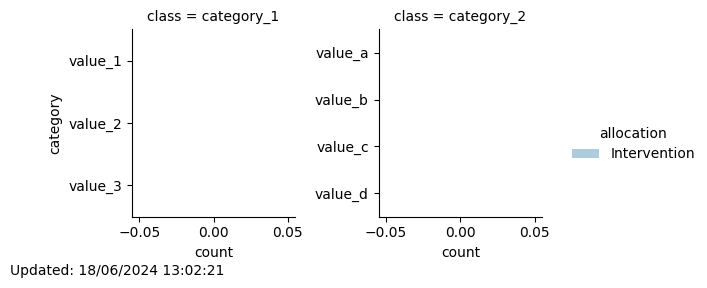

# Minimization
## New participant with id 0 assigned to: Intervention

Total number of participants allocated so far: 1

Of which 0 are in the Control group and 1 are in the Intervention group
### Updated distribution of trial participants:
