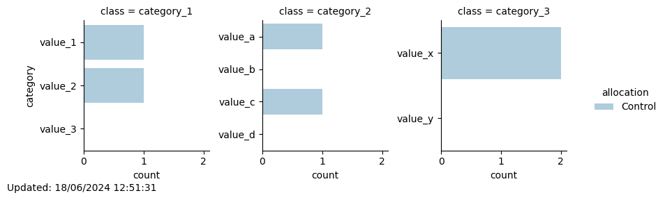

# Minimization
## New participant with id 3 assigned to: Control

Total number of participants allocated so far: 2

Of which 2 are in the Control group and 0 are in the Intervention group
### Updated distribution of trial participants:
