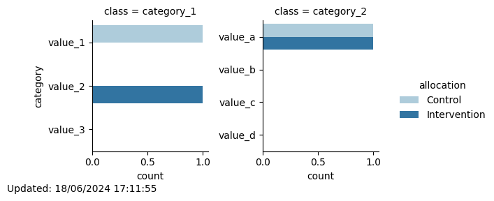

# Minimization
## New participant with id 2 assigned to: Intervention

Total number of participants allocated so far: 2

Of which 1 are in the Control group and 1 are in the Intervention group
### Updated distribution of trial participants:
