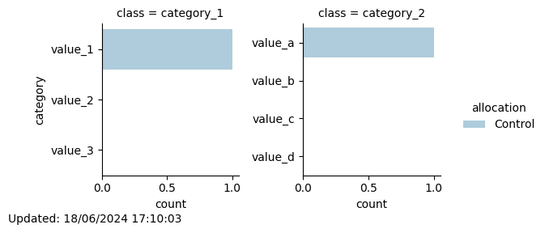

# Minimization
## New participant with id 1 assigned to: Control

Total number of participants allocated so far: 1

Of which 1 are in the Control group and 0 are in the Intervention group
### Updated distribution of trial participants:
