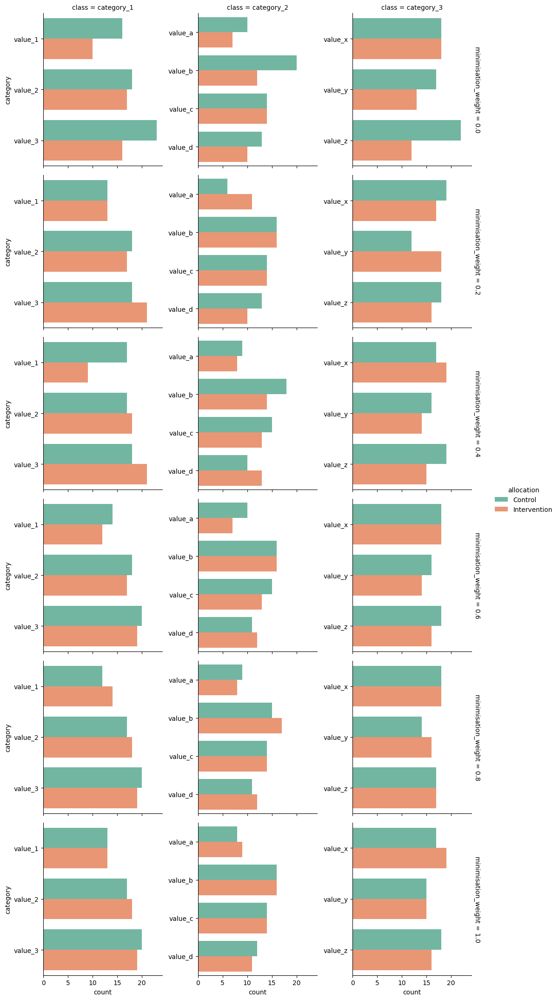

# Minimization

### How to decide what to set the value of minimisation_weight to?

The value of the minimisation_weight variable determines to what extent the allocation of trial participants to either the control or intervention group is governed by the minimisation algorithm, and to what extent the allocation is random. It must be set to a value between 0 and 1, inclusive. 

A value of 0 means that trial participants will be allocated to either group entirely at random, and value of 1 means that their groups will be allocated deterministically. Selecting a value between these two extremes will ensure that a proportion of trial participants will be allocated randomly. 

The following charts are indicative of the impact that different values of this variable may have. They are constructed from the same randomly generated source data, consisting of 100 hypothetical trial participants. The differences between the control and intervention group may be quite pronounced for lower values, but become smaller as minimisation_weight increases. 

